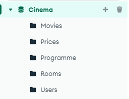
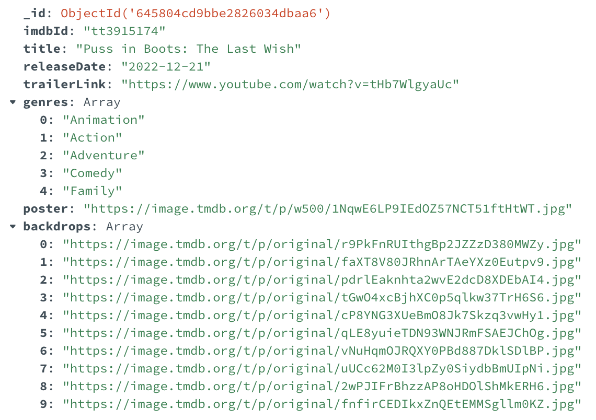
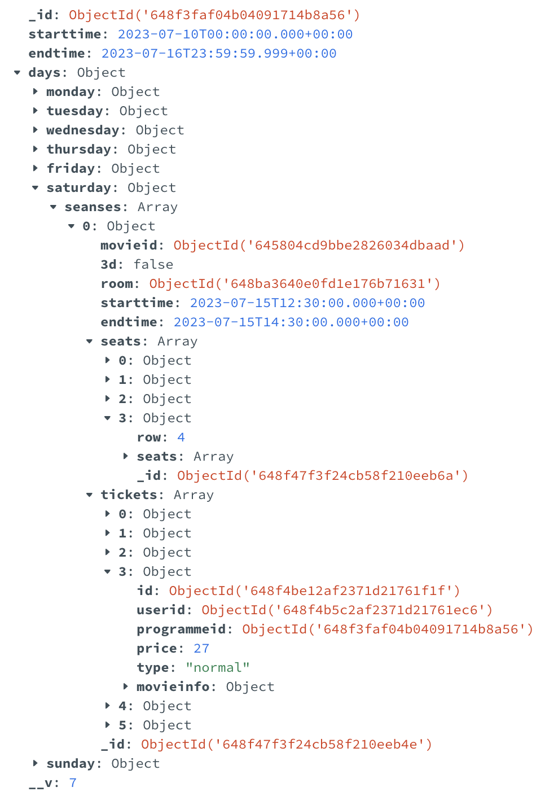
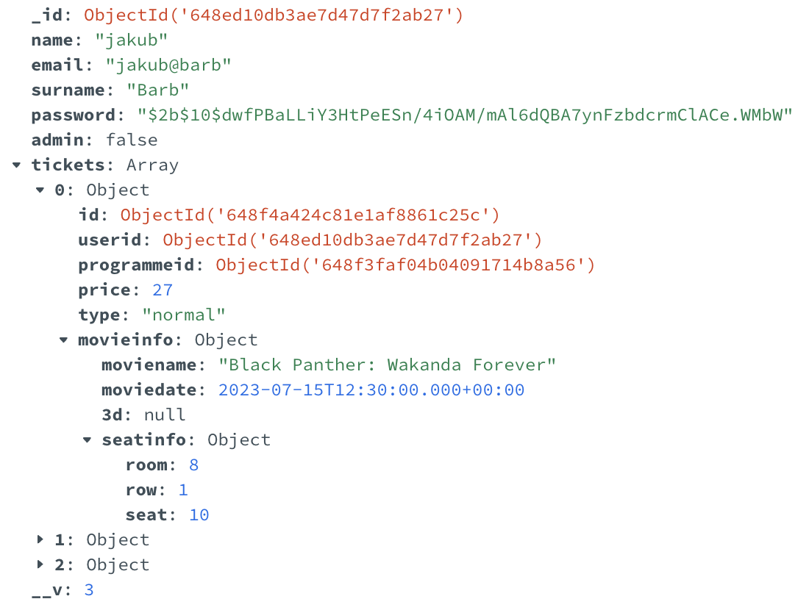
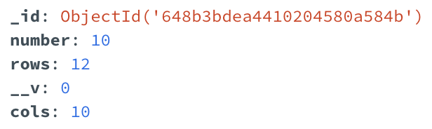
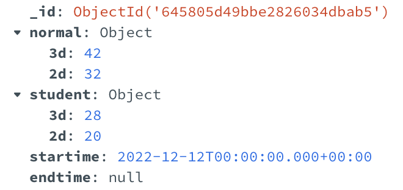

# Work in Progress :construction:

🚧 Implementing GraphQL 🚀

# Database

The database consists of 5 collections: Movies, Programme, Users, Rooms, and Prices.



## Movies

The **Movies** collection contains basic information about the movies shown in our cinema. All data was obtained using the IMDB API. Here's an example document in the Movies collection.



## Programme

The **Programme** collection is the most elaborate structure in our database. Each document represents the repertoire for a given week. It contains the start and end of that week, as well as a **days** object consisting of the 7 days of the week. Each day of the week contains an array of **screenings**. Each **screening** includes basic data, such as **movieid** indicating the movie being shown, the start and end of the screening, an array indicating the availability of seats, and an array of tickets purchased for that screening.



## Users

The **Users** collection contains information about users, both registered on our cinema's website and those who bought tickets using only email (without registration). Each document contains basic user information such as: name, surname, email, hashed password, role, and an array of tickets. The **Ticket** held in the user is identical to the one held in the screening. It consists of foreign keys to the user and the screening, price, type, seat, and includes basic information about the movie for which it was purchased.



## Rooms

The **Rooms** collection contains information about the rooms available in our cinema. Each room is a separate document containing the room number, the number of rows, and the number of seats in a row.



## Prices


In the **Prices** collection, we store the prices for regular and discounted tickets, both for 2D and 3D movies. Additionally, we keep track of the valid duration for each price, including its start and end dates. Current prices have **null** in the **endtime** field.



# Backend

On the backend, we've implemented essential functions needed to manage a cinema application. Below, we showcase a few functionalities that we've implemented.

## Views

**User Tickets View**

```javascript
const getUserTickets = async (req, res) => {
  const ObjectId = mongoose.Types.ObjectId;
  try {
    const user = await User.findById(
      new ObjectId(req.body.userid)
    );
    if (!user) {
      throw new Error("User of given Id does not exist");
    }
    res.status(200).json({ tickets: user.tickets });
  } catch (err) {
    res.status(400).json({ message: err.message });
  }
};
```

**View returning the program valid for a certain date with filled references to movieid and roomid**\
After ensuring the program exists, we perform a query and complete the references with the appropriate objects.

```javascript
const getSeancesOfTheWeek = async (req, res) => {
  const date = new Date(req.body.date);
  try {
    const programme = await Programme.findOne({
      starttime: { $lte: date },
      endtime: { $gte: date },
    });
    await Programme.populateQuery(programme);
    if (!programme) {
      throw new Error("Programme doesn't exist");
    }
    res.status(200).json({ programme: programme });
  } catch (err) {
    res.status(400).json({ message: err.message });
  }
};
```

**View of the repertoire for x given weeks**\
View of the repertoire for the next x weeks (x is determined on the backend). In the returned objects, references are replaced with the corresponding movie and room objects, so the application receives a complete set of data about the given repertoire.

```javascript
const getProgrammeForXWeeksAheadPopulated = async (
  req,
  res
) => {
  const date = new Date();
  try {
    const programmes = await Programme.find({
      endtime: { $gte: date },
    })
      .sort({ endtime: 1 })
      .limit(x);
    if (programmes.length === 0) {
      throw new Error("Programme doesn't exist");
    }
    await Programme.populatePogrammeArray(programmes);
    res.status(200).json({ programmes: programmes });
  } catch (err) {
    res.status(400).json({ message: err.message });
  }
};
```

**View of the list of rooms in our cinema**\
The query returns a list of cinema rooms in our cinema.

```javascript
const getRooms = async (req, res) => {
  try {
    const datatoSave = await Room.find({});
    res.status(200).json({ rooms: datatoSave });
  } catch (err) {
    res.status(400).json({ message: err.message });
  }
};
```

## Procedures

During the implementation, we used the mongoose library for modeling the integrity/coherence conditions of the created documents.
In addition to mongoose validation, it provided us with many functionalities that simplify operations on the MongoDB database, as well as implementation functionalities such as models and static methods on models.

**Procedure for adding a new screening**\
We ensure the existence of a program within a specific time range, check if the room is not occupied on specific hours of the day, and if a movie with the given ID exists.

Helper function - trigger checking if the room is available:

```javascript
const checkPotentialOverlap = (
  start1,
  end1,
  start2,
  end2
) => {
  return (
    (start1 <= start2 && end1 >= end2) ||
    (start1 >= start2 && start1 <= end2) ||
    (end1 >= start2 && end1 <= end2)
  );
};
```

```javascript
const addSeanse = async (req, res) => {
  try {
    const ObjectId = mongoose.Types.ObjectId;
    const date = new Date(req.body.date);
    const programme = await Programme.findOne({
      starttime: { $lte: date },
      endtime: { $gte: date },
    });
    if (!programme) {
      throw new Error("Programme doesn't exist");
    }
    const day = getDayName(date.getUTCDay());
    const foundRoom = await Room.findById(
      new ObjectId(req.body.room)
    );
    console.log(`FoundRoom: ${foundRoom}`);
    if (!foundRoom) {
      throw new Error("This room doesn't exist");
    }
    const starttime = new Date(req.body.starttime);
    const endtime = new Date(req.body.endtime);

    const dailySeanses = programme.days[day].seanses;
    const existsRoomCollision = dailySeanses.find(
      (seanse) =>
        req.body.room === seanse.room.toString() &&
        checkPotentialOverlap(
          starttime,
          endtime,
          new Date(seanse.starttime),
          new Date(seanse.endtime)
        )
    );

    if (existsRoomCollision) {
      throw new Error(
        "Provided Room is occupied at the same time"
      );
    }

    // checking if movie exists
    const movie = await Movie.findById(
      new ObjectId(req.body.movieid)
    );

    if (!movie) {
      throw new Error("Movie doesn't exist");
    }

    const seats = createEmptyRoom(
      foundRoom.rows,
      foundRoom.cols
    );
    const seanse = {
      movieid: new ObjectId(req.body.movieid),
      "3d": req.body.is3d,
      room: new ObjectId(req.body.room),
      starttime: starttime,
      endtime: endtime,
      seats: seats,
      tickets: [],
    };
    programme.days[day].seanses.push(seanse);
    const updatedProgramme = await programme.save();
    res.json({
      programme: updatedProgramme,
      seanse: seanse,
    });
  } catch (err) {
    res.json({ message: err.message });
  }
};
```

**Procedure for adding a new program**\
We ensure that the program starts on Monday and ends on Sunday (we set the hours in the dates to zero to cover the entire week),
making sure beforehand that there is no existing program within the specified time range.

```javascript
const addProgramme = async (req, res) => {
  const starttime = new Date(req.body.starttime);
  const endtime = new Date(req.body.endtime);
  starttime.setUTCHours(0, 0, 0, 0);
  endtime.setUTCHours(23, 59, 59, 999);
  try {
    if (
      getDayName(starttime.getUTCDay()) !== "monday" ||
      getDayName(endtime.getUTCDay()) !== "sunday"
    ) {
      throw new Error(
        "Programme must take whole week (from monday to sunday) "
      );
    }
    const programmeFound = await Programme.findOne({
      $expr: {
        $and: [
          {
            $gte: [
              {
                $dateToString: {
                  format: "%Y-%m-%d",
                  date: "$starttime",
                },
              },
              {
                $dateToString: {
                  format: "%Y-%m-%d",
                  date: starttime,
                },
              },
            ],
          },
          {
            $lte: [
              {
                $dateToString: {
                  format: "%Y-%m-%d",
                  date: "$endtime",
                },
              },
              {
                $dateToString: {
                  format: "%Y-%m-%d",
                  date: endtime,
                },
              },
            ],
          },
        ],
      },
    });
    if (programmeFound) {
      throw new Error(
        `Program in given timestamps already exists and has id: ${programmeFound._id}`
      );
    }
    const programme = new Programme({
      starttime: starttime,
      endtime: endtime,
      days: {
        monday: { seanses: [] },
        tuesday: { seanses: [] },
        wednesday: { seanses: [] },
        thursday: { seanses: [] },
        friday: { seanses: [] },
        saturday: { seanses: [] },
        sunday: { seanses: [] },
      },
    });
    const savedProgramme = await programme.save();
    res.json({ programme: savedProgramme });
  } catch (err) {
    res.json({ message: err.message });
  }
};
```

**Registering a new user**\
We ensure that the email is not already present in our database, check if we have received all the necessary data for registration,
and if everything is correct, we add a new user to the database.

```javascript
const registerUser = async (req, res) => {
  try {
    const user = await User.find({ email: req.body.email });
    if (user.length !== 0) {
      throw new Error(
        "User with given email already exists"
      );
    }
    if (
      !req.body.password ||
      !req.body.name ||
      !req.body.surname
    ) {
      throw new Error(
        "Not full data about new client has been provided"
      );
    }
    const hashedPassword = await generateHash(
      req.body.password
    );
    const data = new User({
      ...req.body,
      password: hashedPassword,
      tickets: [],
    });

    const datatoSave = await data.save();
    res.status(200).json({
      user: {
        id: datatoSave._id,
        email: datatoSave.email,
        name: datatoSave.name,
        surname: datatoSave.surname,
      },
    });
  } catch (err) {
    res.status(400).json({ message: err.message });
  }
};
```

**User login procedure**\
Verification of the correctness of the hashed password and the email provided during login, followed by sending feedback to the frontend.

```javascript
const loginUser = async (req, res) => {
  const { email, password } = req.body;
  if (!email || !password) {
    throw new Error(
      "Email or password hasnt been specified"
    );
  }
  try {
    const foundUser = await User.findOne({ email: email });
    if (!foundUser) {
      throw new Error("User of given email doesnt exist");
    }
    const passwordsMatch = await comparePasswords(
      password,
      foundUser.password
    );
    if (!passwordsMatch) {
      throw new Error("Incorrect password for given email");
    }
    res.status(200).json({
      user: {
        email: foundUser.email,
        id: foundUser._id,
        name: foundUser.name,
        surname: foundUser.surname,
      },
    });
  } catch (err) {
    res.status(400).json({ message: err.message });
  }
};
```

**Adding a room**\
Adding a room with the specified parameters (rows, cols) and number, after ensuring that there is no existing room with the same number in our cinema.

```javascript
const addRoom = async (req, res) => {
  try {
    const room = await Room.findOne({
      number: req.body.number,
    });
    if (room) {
      throw new Error(
        "Room of given number already exists"
      );
    }
    const data = new Room(req.body);
    const datatoSave = await data.save();
    res.status(200).json({ room: datatoSave });
  } catch (err) {
    res.status(400).json({ message: err.message });
  }
};
```

**Procedure for adding a ticket**\
This procedure is quite extensive, so we will present excerpts here.

In order to return the appropriate response to the frontend, instead of movieid/roomid, we use the entire model by using mongoose's populate feature at that specific location.
We have created our static method on the model, which uses populate to replace the IDs with data in each screening.

```javascript
programmeSchema.statics.populateQuery = async function (
  programme
) {
  for (const day of dayNames) {
    await this.populate(programme, {
      path: `days.${day}.seanses`,
      model: "SingleSeance",
      populate: [
        {
          path: "movieid",
          model: "Movie",
        },
        {
          path: "room",
          model: "Room",
        },
      ],
    });
  }
  return programme;
};
```

To add tickets simultaneously to the Users and Programmes collections, we use transactions. We utilize the same ticket ID.
By using transactions, if one of the additions fails, we simply abort the entire process.

```javascript
seanseFound.seats[row].seats[col].availability = false;
await programme.save();
//add ticket in both places using transactions
const session = await mongoose.startSession();
session.startTransaction();
try {
  ticket = {
    id: new mongoose.Types.ObjectId(),
    userid: user._id,
    programmeid: programme._id,
    seanseid: seanseid,
    price: req.body.price,
    type: req.body.type,
    movieinfo: {
      moviename: moviename,
      moviedate: moviedate,
      "3d": is3d,
      seatinfo: {
        room: roomnumber,
        row: row,
        seat: seatnumber,
      },
    },
  };
  seanseFound.tickets.push(ticket);
  user.tickets.push(ticket);
  await user.save();
  await programme.save();
  await session.commitTransaction();
  session.endSession();
} catch (error) {
  await session.abortTransaction();
  session.endSession();
  seanseFound.seats[row].seats[col].availability = true;
  await programme.save();
}
```
